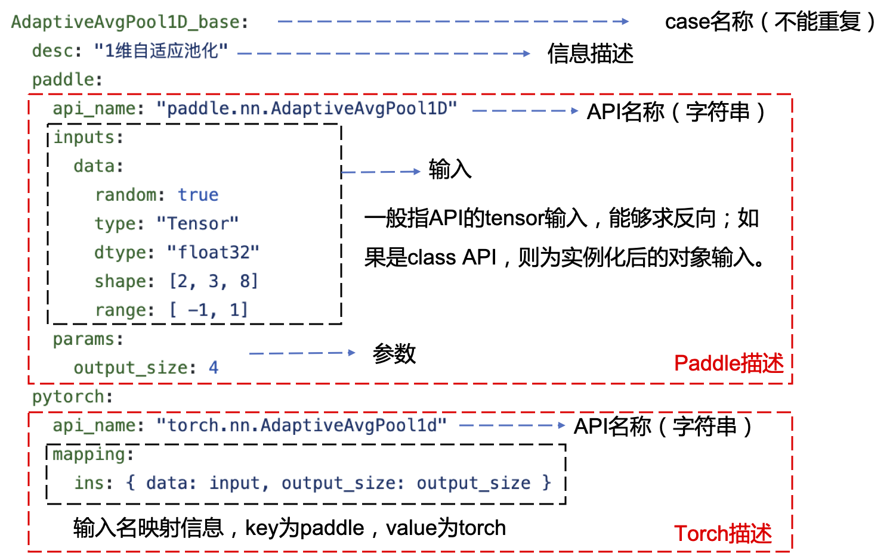

# API竞品测试框架
## 介绍
给定相同输入，对比paddle和pytorch相同功能API的计算结果。

## 模块功能
```
.    ------------------------> 竞品框架根目录
├── README.md
│
├── yaml_excutor.py ------------>  执行器
│
├── competitor/     ------------>  yaml解析和竞品对照
│       │
│       ├── comptrans.py ----------------->  yaml解析器，继承自weaktrans
│       │
│       ├── competitive.py --------------->  与torch对比，包括前向和反向计算结果
│       │
│       └── tool.py     ------------------>  工具函数和类
│
└── ../yaml/  ----------------->  case存放地址
```

## case描述
API case是通过yaml文件描述，内容包括paddle和torch的对比信息。[存放位置](https://github.com/PaddlePaddle/PaddleTest/tree/develop/framework/e2e/yaml)



如图所示，一个yaml测试case主要由四部分组成：
- case名称：用于区分不同case，因此case名不能重复
- 信息描述：简述API功能
- paddle信息描述：包括api名称、输入和参数（可选）；其中输入主要为tensor数据类型，可通过random设置生成tensor是否随机，dtype设置tensor数据类型（支持int，float，complex），shape指定tensor形状，range指定tensor的数值范围；参数支持int、float、complex、list、tuple、Tensor等类型
- torch信息描述（可选）：包括api名称和输入名映射信息；其中mapping是从paddle输入名到torch输入名的映射，支持参数数量差异；另外，torch描述为可选内容，若不设置，则跳过此case

## 测试内容
根据yaml描述分别生成paddle和torch的api和输入，在cpu或cpu、gpu设备上，对所有数据类型进行API前向和反向计算，对比paddle和torch的结果。

## 执行

```
git clone https://github.com/PaddlePaddle/PaddleTest.git

cd PaddleTest/tree/develop/framework/e2e/competitor

python yaml_executor.py
```
